# Hi there, I'm Prasetiyo Hadi Purwoko 👋

**Infrastructure Architect | DevOps Specialist | MSc. Computational Science**

I am a seasoned IT professional with over 12 years of experience in DevOps and
System Administration. My expertise lies in architecting cost-efficient,
scalable platforms that bridge the gap between development and operations.

---

## 🚀 About Me

- 🔭 **Last Role:** Infrastructure Architect at
  [Bukalapak.com](https://www.bukalapak.com).
- 🏗️ **Core Focus:** Building reliable, automated, and cost-effective
  Infrastructure as Code (IaC) environments.
- 🎓 **Education:** Master in Computational Science & B.Eng in Engineering
  Physics from **Institut Teknologi Bandung (ITB)**.
- 📍 **Location:** Bandung, Indonesia.

---

## 🛠️ Tech Stack & Expertise

| Category               | Tools & Technologies                        |
| :--------------------- | :------------------------------------------ |
| **IaC & Provisioning** | Terraform, Ansible, Packer                  |
| **Orchestration**      | Kubernetes, Docker                          |
| **CI/CD Pipelines**    | GitLab CI/CD, ArgoCD, Ansible AWX           |
| **Observability**      | Prometheus, Grafana, Alertmanager           |
| **Logging & Tracing**  | ELK Stack (Elasticsearch, Logstash, Kibana) |
| **Legacy Systems**     | Network & Mail Administration (DITSTI ITB)  |

---

## 📊 GitHub Stats

---

## 🤝 Connect with Me

- **LinkedIn:**
  [linkedin.com/in/prasetiyohadi](https://linkedin.com/in/prasetiyohadi)
- **Portfolio/Website:** [Pras' Workspace](https://pras.my.id)

_"Enabling DevOps culture through automation and architectural excellence."_
