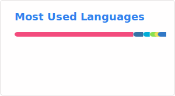

# Hi there, I'm Prasetiyo Hadi Purwoko 👋

**Infrastructure Architect | DevOps Specialist | MSc. Computational Science**

12+ years designing and operating large-scale infrastructure platforms —
from bare-metal data centers to multi-cloud architectures serving millions
of users. Comfortable owning long-term platform decisions, not just
executing them.

---

## 🚀 About Me

- 🏢 **Recent:** Senior DevOps Engineer (Contract) at
  [Aliz](https://aliz.ai) — premier Google Cloud partner. (Oct–Dec 2025)
- 🔭 **Before that:** Infrastructure Architect at
  [Bukalapak.com](https://www.bukalapak.com) — IaC framework adopted by
  50+ engineering teams across 100+ microservices at 50K+ RPS.
- 🏗️ **Core Focus:** Building reliable, automated, and cost-effective
  Infrastructure as Code (IaC) environments.
- 💡 **Currently:** Building hands-on DevOps & platform engineering labs —
  GitLab CI pipelines and Kubernetes GitOps demos.
  Writing the journey on [Medium](https://medium.com/@pras-labs).
- 🎓 **Education:** Master in Computational Science & B.Eng in Engineering
  Physics from **Institut Teknologi Bandung (ITB)**.
- 📍 **Location:** Bandung, Indonesia.

---

## 🛠️ Tech Stack & Expertise

| Category               | Tools & Technologies                                       |
| :--------------------- | :--------------------------------------------------------- |
| **Cloud Platforms**    | GCP (Landing Zone, VPC Service Controls), Azure            |
| **IaC & Provisioning** | Terraform, Ansible, Packer                                 |
| **Orchestration**      | Kubernetes, Docker, Helm                                   |
| **CI/CD Pipelines**    | GitLab CI/CD, ArgoCD, Ansible AWX                          |
| **Observability**      | Prometheus, Grafana, Alertmanager                          |
| **Logging & Tracing**  | ELK Stack (Elasticsearch, Logstash, Kibana)                |
| **Data & Storage**     | Redis, MySQL (multi-master), Hadoop/HBase                  |
| **Programming**        | Python, Go, Bash                                           |

---

## 📊 GitHub Stats

---

## 🤝 Connect with Me

- **LinkedIn:**
  [linkedin.com/in/prasetiyohadi](https://linkedin.com/in/prasetiyohadi)
- **Medium:** [medium.com/@pras-labs](https://medium.com/@pras-labs)
- **Email:** [me@pras.my.id](mailto:me@pras.my.id)
- **Portfolio/Website:** [Pras' Workspace](https://pras.my.id)

_"Enabling DevOps culture through automation and architectural excellence."_
